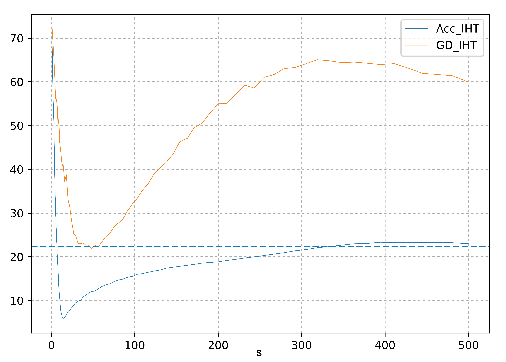
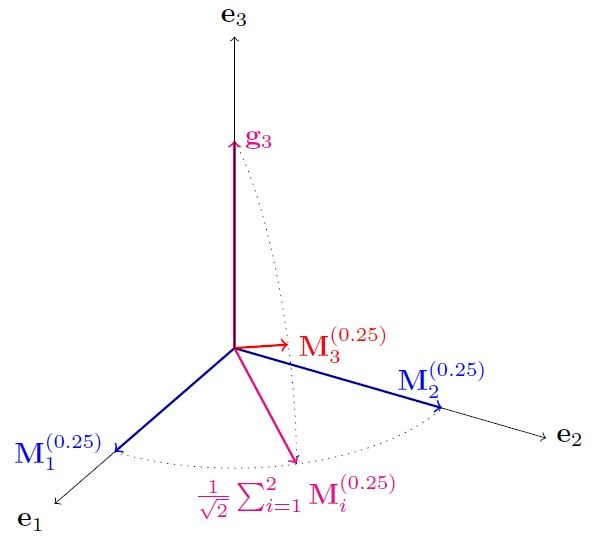
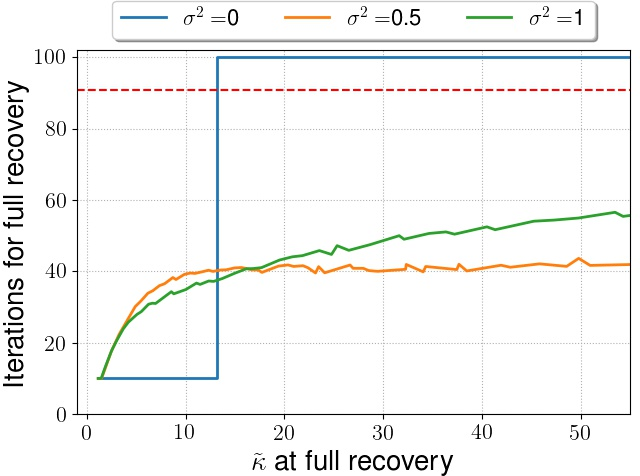
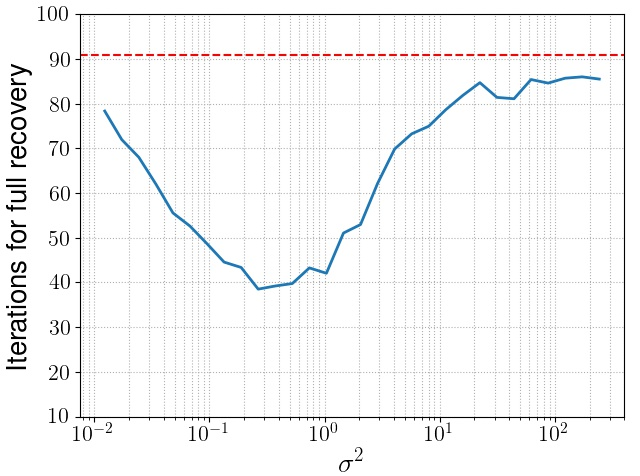

We study the problem of Sparse Regression, a landmark problem in the domain of Machine Learning, Statistics and Optimization which finds numerous applications in Compressed Sensing, model compression, high dimensional statistics, bio-informatics, [resource constrained machine learning](https://www.microsoft.com/en-us/research/project/resource-efficient-ml-for-the-edge-and-endpoint-iot-devices/) and more. Sparse Regression can be written down as an optimization problem as

$$
\xbar = \argmin\limits_{\lznorm{\x}\leq \sstar} f(\x)
$$

where $$\x\in\Rd{d}$$, $\sstar$ much smaller than $d$, the ambient dimension, $$\lznorm{\cdot}$$ is the $$\ell_0$$ norm that denotes the number of non-zero elements of its arguments, and $$f$$ is a real valued function.

Our focus has been on the linear version of the problem where given $$n$$ samples of $$d$$ dimensional data $$\A\in\Rd{n\times d}$$ and a response vector $$\y\in\Rd{d}$$, we want to recover a $$\sstar$$-sparse vector $$\xbar$$ that minimizes the squared loss function $$\esqnorm{\A\x-\y}$$. However, this problem can be shown to be NP-hard via a [reduction to 3-set cover](https://pdfs.semanticscholar.org/f629/5fd69d76d606f66cc15f58767a8161d60335.pdf), nonetheless this problem has been studied under a variety of assumptions such as the ones below
1. **Mutual Incoherence** - Implies that the $$\abs{\inner{\A_i,\A_j}}$$ should be bounded by some small positive real number $$M$$ for all $$i\neq j$$. In specific it can be shown OMP (which we will discuss in detail below) can recover $$\xbar$$ in exactly $$\sstar$$ steps if $$M\leq \inv{2\sstar-1}$$. Refer [Theorem 5.14, Foucart and Rauhut](http://www.cis.pku.edu.cn/faculty/vision/zlin/A%20Mathematical%20Introduction%20to%20Compressive%20Sensing.pdf) for a short proof.
Note that this can be equivalently written as
\$$
\infnorm{vec(\A^T\A - \I_{d})} \leq M.
$$
2. **Restricted Isometry Property (RIP)** - Instead of enforcing an element-wise restcriction on the off-diagonals of the matrix $$\A^T\A$$, RIP (at a level $$s$$) requries a more general assumption that all $$s$$-sized principal block sub-matrices of $$\A^T\A$$ are $$\delta_s$$ close to $$\I_s$$ in the operator norm, i.e., $$ \enorm{\A_\Sset^T\A_\Sset-\I_s} \leq \delta_s$$.
Note that this also implies the below inequality

$$(1-\delta_s)\esqnorm{\vvec} \leq \esqnorm{\A\vvec} \leq (1+\delta_s)\esqnorm{\vvec} \ \forall\ \vvec \in\Rd{d} \text{ s.t. } \lznorm{\vvec} \leq s.$$

It can be easily shown that Mutual Incoherence $$\implies$$ RIP via $$\roundbrack{\delta_s\leq M(s-1) \ \forall\ s\geq 2}$$. Refer [Lemma A.1, Donoho, Elad, Temlyakov](http://citeseerx.ist.psu.edu/viewdoc/download?doi=10.1.1.84.7896&rep=rep1&type=pdf) for a short proof.
3. **Restricted Null Space property** - Implies that all the vectors in the null space of $$\A$$ (except $$\zero$$) are far from being sparse. This property essentially characterizes when $$\ell_1$$ based sparse recovery algorithms work. Formally it requires
\$$
\curlybrack{\vvec\in\Rd{d} \mid \A\vvec = \zero}\cap\curlybrack{\vvec \in \Rd{d} \mid \norm{1}{\vvec_{\Sset^\mathsf{c}}} \leq \norm{1}{\vvec_\Sset}} = \zero.
$$
Restricted Null Space property an even weaker assumption than RIP.
4. **Restricted Strong Convexity (RSC)** - This is a generalization of RIP as in the contraction that $$\A$$ as an operator can perform on any $$s$$-sparse vector $$\vvec$$ can be arbitrariliy small (but not $$0$$). It essentiall means that there is a significant difference (in the $$\ell_2$$ norm sense) in the responses of 2 candidate sparse vectors which differ in their support by at most $$s$$. Formally,

$$\esqnorm{\A\x-\A\z} \geq \rsc{s}\esqnorm{\x-\z}\quad \forall\ \x,\z\in\Rd{d} \text{ s.t. } \lznorm{\x-\z} \leq s$$

where $$\rsc{s}$$ is the RSC constant at the level $$s$$. RSC is the weakest and the most popular asumption of all mentioned for sparse regression problems studied in the context of various algorithms.

Mutual Incoherence $$\implies$$ RIP $$\implies$$ Restricted Null Space Property $$\implies$$ RSC.
{: style="font-size: 120%; text-align: center;"}

The Linear form of Sparse Linear Regression $$\roundbrack{\slr}$$ is a representative problem and results typically extend easily to the general case. We consider the statistical setting of $$\slr$$ where the response is corrupted by adding an i.i.d. gaussian noise vector. We attempt to study this problem under the RSC assumption for a greedy algorithm Orthogonal Matching Pursuit algorithm.

$$
\y = \A\xbar + \etavec = \A_{\Sstar}\xbar_{\Sstar} + \etavec
$$

where $$\etavec\sim \mathcal{N}\roundbrack{\zero,\sigma^2 \I_n}$$ has i.i.d. normally distributed elements with variance $$\sigma^2$$, and $$\text{supp}(\xbar) = \sstar$$.

# Questions of interest
1. For any sparse regression algorithm, bounding the generalization error under a statistical model is a major machine learning goal. Here, the generalization error is defined as
$$
G(\x) = \inv{n}\esqnorm{\A\x-\y}
$$
where the rows of $$\A$$ are i.i.d. samples from some data distribution.
2. Bounding the generalization error alone does not guarantee that the algorithm recovers the true support. This can be loosely answered by arguing if the algorithm can output a support set $$\Sset$$ such that $$\Sset \supseteq \Sstar$$. Ideally one would like to have the smallest such set $$\Sset$$ satisfying the superset condition.

It is to note that given support recovery, smaller the support set size, lower is generalization error. Recovering the true support is a fundamentally harder problem as strong support recovery results usually tend to provide strong generalization error bounds.

Below we describe the 2 algorithms we looked at during the project span.

## Algorithms for $$\slr$$
Broadly, existing sparse regression algorithms can be broadly categorized into 3 categories.
1. $$\ell_1$$ minimization or LASSO based algorithms. E.g. - [Dantzig selector](https://arxiv.org/pdf/math/0506081.pdf) etc.
2. Non-convex penalty based. E.g. - [Iterative Hard Thresholding](https://papers.nips.cc/paper/5293-on-iterative-hard-thresholding-methods-for-high-dimensional-m-estimation.pdf), [Penalty based methods like SCAD penalty, Log-sum penalty](https://arxiv.org/abs/1412.5632) etc.
3. Greedy methods. E.g. - [Orthogonal Matching Pursuit (OMP)](http://citeseerx.ist.psu.edu/viewdoc/download?doi=10.1.1.55.1254&rep=rep1&type=pdf) etc.

## Iterative Hard Thresholding
Iterative Hard Thresholding as from the name suggests, takes a dense gradient step from the current $s$-sparse iterate at each iteration, and projects the dense iterate back to the $s$-sparse set by keeping only the top $s$ elements in terms of their absolute values. We fix a learning rate, and start at $\x_0 = \zero$. At the $t^{th}$ iteration
1. $$\x_{t+1} = \mathcal{P}_s\roundbrack{\x_t - \eta\nabla_{\x}f(\x_t)}$$.

where $\mathcal{P}_s$ is the operator that projects its arguments to the $s$-sized $\ell_0$ ball. This can be easily done via sorting the elements of the argument vector based on their absolute values. The algorithm starts at $\zero$ and refines the solution at each step keeping only the $s$ dominant values in its iterates.

## Orthogonal Matching Pursuit
As a greedy algorithm, OMP is one of the most simple and classical algorithm that works in an incremental fashion such that at each step, one feature is added to the support set based on a criterion, and so the size of the support set of equal to the number of steps OMP is run.

We start with the null set with the initial estimate of the solution being $$\zero$$. At each step, we compute the residual and look at the remaining features to see which feature best explains the residual and include the feature into the support set. The next iterate is the one which best optimizes the convex quadratic loss with the support of the variable restricted to the current support set. This can be easily computed using a least squares solver.

Compactly, with $$\Sset_0 = \phi$$, $$\x_0 = \zero$$, $$\res_0 = \y-\A\x_0 = \y$$. At the $$k^{th}$$ iteration,
1. \$$j \gets \argmax\limits_{i\not\in\Sset_{k-1}} \abs{\A_i^T\res_{k-1}}$$
2. \$$\Sset_k \gets \Sset_{k-1} \cup \curlybrack{j}$$
3. \$$\x_k \gets \argmin\limits_{\text{supp}(\x)\subseteq\Sset_k} \esqnorm{\A\x-\y}$$
4. \$$\res_k \gets \y - \A\x_k = \y - \A_{\Sset_k}\x_k$$

Interestingly, note that $$\abs{\A_i^T\res_{k-1}} \propto \squarebrack{\nabla f(\x_{k-1})}_i$$ for $$f(\x) = \esqnorm{\A\x-\y}$$ and the algorithm can be easily modified for a general function $$f$$ for which step 3 is cheap.

## Quantities of interest

To formalize the problem, let us define some key problem dependent quantities on which the problem depends on
1. **Restricted Smoothness $$(\rss{s})$$ and Restricted Strong Convexity $$(\rsc{s})$$** -
\$$
\rsc{s}\esqnorm{\x-\z} \leq \esqnorm{\A\x-\A\z} \leq \rss{s}\esqnorm{\x-\z}\qquad \forall\ \x,\z \text{ s.t. }\lznorm{\x-\z}\leq s.
$$
2. **Restricted Condition number ($$\kappas{s}$$)** -
\$$
\kappas{s} = \frac{\rss{1}}{\rsc{s}}
$$
3. We also define the quantity similar to usual condition number where both the Restricted Smoothness and the Restricted Strong Convexity are at the same level $$s$$
\$$
\kappa_{s} = \frac{\rss{s}}{\rsc{s}} \geq \kappas{s}
$$

The Restricted Condition number is essentially a normalized way of referring to the inverse Restricted Strong Convexity, and therefore is a measure that determines the hardness of the problem.

## Lower bounds for Fast Rate

Let us say for a moment that one can actually find the best minimizer to the $$\slr$$ problem. Let $$\xhat_{\ell_0}$$ be the best $$\ell_0$$ estimate in the set of all $$\sstar$$-sparse vectors. Then one can show that the expected generalization error for the worst problem is upper bounded by the fast rate, that is

$$
\sup\limits_{\lznorm{\xbar}\leq \sstar}\E{\esqnorm{\A(\xhat_{\ell_0}-\xbar)}} \lesssim \inv{n}\sigma^2\sstar\log d
$$

But the question than one might ask is how can one compute the estimate $\xhat_{\ell_0}$? Because this problem is NP-hard, one trivial way therefore is to search over all $${d \choose \sstar}$$ $\sstar$ sized subsets of $$\squarebrack{d}$$. This is practically infeasible due to its complexity, therefore bounding the generalization error under the restriction that the estimate is polynomial time computable is a more practical question to ask.

[Y. Zhang, M. Wainwright & M. Jordan' 2014](https://people.eecs.berkeley.edu/~jordan/papers/zhang-wainwright-jordan-ejs.pdf) come up with a lower bound proving that there exists a bad design matrix $$\A_{\text{bad}}$$, such that if $$\xhat_{\text{poly}}$$ is the output of any polynomial time algorithm, then the generalization error is lower bounded by a similar quantity but with an extra factor of $$\kappas{\sstar}$$.

$$
\sup\limits_{\lznorm{\xbar}\leq \sstar}\E{\esqnorm{\A_{\text{bad}}(\xhat_{\text{poly}}-\xbar)}} \gtrsim \inv{n}\sigma^2\kappas{\sstar}\sstar\log d
$$

As a consequence to their work, any estimator $$\xhat$$ that achieves the fast rate must either not be polynomial time computable, or must not return a $$\sstar$$-sparse vector.

The tightest upper bounds on the generalization error known before this work for algorithms like IHT, OMP and Lasso were at least $$\kappas{}$$ times worse than this lower bound. A question then arises from this gap is whether the lower bound is itself loose or if there exists an algorithm for which we can have a better upper bound matching the known lower bound up to constants.

## Attempts with IHT

To understand the gap better, we first started off by trying to tighten the upper bound proven by [Jain et. al.](https://papers.nips.cc/paper/5293-on-iterative-hard-thresholding-methods-for-high-dimensional-m-estimation.pdf) for a candidate algorithm, Iterative Hard Thresholding. Their analysis requires IHT to be run at a level $$s\geq \mathcal{\Omega}(\kappa_s^2\sstar)$$ for linear convergence in the function space. Bringing it down to $$s\geq \mathcal{\Omega}(\kappa_s\sstar)$$ would result in a much better generalization error bound than the ones they have. We tried incorporating several variants of acceleration into IHT to bring down the required expansion to at least $$s\geq \mathcal{\Omega}(\kappa_s\sstar)$$ but the trivial analysis breaks down at certain points. However, there are strong empirical instances where Gradient Descent based IHT is inferior to Accelerated IHT.

{:class="img-responsive" .align-center width="60%"}

The above plot describes how the error $$\enorm{\A\xhat_s-\y}$$ changes when we run IHT up to convergence at level $$s$$ (on the x-axis). The blue-dashed line represents the Euclidean norm of the noise. We see that Accelerated IHT uniformly achieves lower function value and dips earlier than the vanilla IHT. It was also observed that the rate of convergence of Accelerated IHT is much better than vanilla IHT and exhibits an oscillation behavior just like the error dynamics in the usual Nesterov's acceleration.

## Attempts with OMP

We restart exploring this gap by considering the classical algorithm OMP. Because OMP is a greedy algorithm, coming up with a lower bound instance for the support recovery is easy. For this we need to construct a matrix $$\M$$ such that it has a controlled Restricted Condition number $$\kappas{s}$$ but still with high probability, at each step OMP ends up picking incorrect features and recovers the true support at the near end. Because the generalization error typically increases as the algorithm picks incorrect features, the generalization error incurred by OMP would be high.

### Lower bound instance construction

We construct a parameterized matrix $$\M^\brackeps\in\Rd{n\times d} (d\leq n)$$ by $$0\leq \epsilon\leq 1$$ such that all the $$\sstar$$ columns of the true support $$\Sstar$$ are orthogonal and the remaining columns are linear combinations of the mean of the true features and vectors orthogonal to their subspace. Precisely,
1. $$ \M^\brackeps_{1:\sstar} $$ are random $$\sstar$$ orthgonal vectors s.t. $$\esqnorm{\M^\brackeps_i} = n \ \forall\ i\in\squarebrack{\sstar}$$.
2. $$ \M^\brackeps_i = \sqrt{1-\epsilon}\squarebrack{\inv{\sqrt{\sstar}}\sum\limits_{j=1}^{\sstar} \M^\brackeps_j} + \sqrt{\epsilon}\g_i \ \forall i\not\in\squarebrack{\sstar}$$ where $$\g_i$$'s are orthogonal to each other and $$\M^\brackeps_{1:\sstar}$$ with $$\esqnorm{\g_i} = n$$.

Below is a sketch to illustrate an example with $$n=d=3, \sstar=2$$ and $$\epsilon=0.25$$.

{:class="img-responsive" .align-center width="50%"}

Note that by tuning $$\epsilon$$, we can either make the incorrect features very close to the subspace spanned by the correct features or keep then almost orthogonal. This is evident if we take the dot product of a correct feature $$i\in\Sstar$$ with an incorrect feature $$k\not\in\Sstar$$.

$$
\begin{align}
\inner{\M^\brackeps_i,\M^\brackeps_k} &= \inner{\M^\brackeps_i,\sqrt{1-\epsilon}\squarebrack{\inv{\sqrt{\sstar}}\sum\limits_{j=1}^{\sstar} \M^\brackeps_j} + \sqrt{\epsilon}\g_k}\\
&= \inner{\M^\brackeps_i,\sqrt{1-\epsilon}\inv{\sqrt{\sstar}} \M^\brackeps_i}\\
&= n\sqrt{\frac{1-\epsilon}{\sstar}}
\end{align}
$$

Therefore higher $$\epsilon$$ implies lower cross-set inner products, which in turn implies lower Restricted Condition number. We cannot set $$\epsilon$$ to be very high as we will not be able to fool OMP into picking up incorrect features. Therefore we can solve for the interval of $$\epsilon$$ so that OMP at each step picks up an incorrect feature.

We easily show that under the noiseless setting $(\sigma = 0)$, if OMP is run on $\M^\brackeps$ for $\epsilon<1-\inv{\sstar}$, then OMP will continue including incorrect features untill only the correct ones are left. Because we want Restricted Condition number to be as low as possible so that OMP fails, any value of $\epsilon = 1-\frac{\alpha}{\sstar}$ is good for constant $\alpha>1$.

### Upper Bounding Generalization Error

The tightest known upper bounds for polynomial time algorithms like IHT, OMP and Lasso were at least $\kappas{}$ times worse than the fast rate lower bound. [Lemma A.5, T. Zhang' 10](https://arxiv.org/pdf/1005.2249.pdf) have the loose upper bound on the sub-optimality gap but after only $s=\Theta\roundbrack{\kappas{s}\log\kappa_s \sstar}$ steps. This result gives a hint and a hope for a stronger generalization error because of the lower order of iterations. We exploit their line of analysis and tighten their sub-optimality gap by a factor of $\kappa_s$

> **Result directly using T. Zhang's bound** - If $\xhat_s$ is the outout of OMP after $s=\Theta\roundbrack{\kappas{s}\log\kappa_s \sstar}$ iterations, then with high probability  
> 
> $$
> \begin{equation}
> \inv{n}\esqnorm{\A(\xhat_s-\xbar)} \lesssim \inv{n}\sigma^2\sstar\kappas{s+\sstar}^2\log\kappa_{s+\sstar}\log d
> \end{equation}
> $$

Upon slight modifications and tightening T. Zhang's analysis, we prove a better generalization bound that matches the fast rate up to logarithmic factors in $\kappa$.

> **Result after modifying T. Zhang's analysis** - If $\xhat_s$ is the outout of OMP after $s=\Theta\roundbrack{\kappas{s}\log\kappa_s \sstar}$ iterations, then with high probability  
> 
> $$
> \begin{equation}
> \inv{n}\esqnorm{\A(\xhat_s-\xbar)} \lesssim \inv{n}\sigma^2\sstar\kappas{s+\sstar}\log\kappa_{s+\sstar}\log d
> \end{equation}
> $$

### Gaussian Ensemble upper bounds

We can instantiate the above results for Gaussian ensembles, i.e. when the rows of $\A$ are sampled from a multivariate Gaussian distribution $\mathcal{N}\roundbrack{\zero,\SIGMA}$. If $\sigma_\max$ and $\sigma_\min$ are the maximum and minimum singular values of $\SIGMA$, and $\kappa(\SIGMA) = \sigma_\max/\sigma_\min$ is its condition number, then we achieve the best known generalization error guarantee in terms of the dependence on $\kappa(\SIGMA)$.

> **Generalization error for Gaussian Ensemble** - If $\SIGMA_{ii} \leq 1 \ \forall\ i\in\squarebrack{d}$, $n = \mathcal{\Omega}\roundbrack{\frac{s\log d}{\sigma_\min}}$ and if $\xhat_s$ is the output of OMP after $s=\Theta\roundbrack{\kappa(\SIGMA)\log\kappa(\SIGMA) \sstar}$ iterations where $\Sset = \supp{\xhat_s}$, then with high probability,
> 
> $$
> \inv{n}\esqnorm{\A(\xhat_s-\xbar)} \leq \inv{n}\sigma^2\kappa(\SIGMA)\log \kappa(\SIGMA) \sstar \log d
> $$

This result is a corollary of the general generalization upper bound result using some concentration results.

### Support Recovery upper bound

[Loh' 14](https://arxiv.org/abs/1412.5632) have strong support recovery results on non-convex regularization based algorithms that use SCAD/MCP like penalty, but they require the mutual incoherence of the matrix $\A$ to be bounded by $1$ which is independent of any problem parameter and is too much to ask for. For greedy algorithms like [HTP](http://proceedings.mlr.press/v70/shen17a.html) and [PHT](https://papers.nips.cc/paper/6905-partial-hard-thresholding-towards-a-principled-analysis-of-support-recovery) however, we have doubts about the correctness of the analysis in the latter result.

We prove and exploit a crucial property for OMP that if at any iteration there is a true feature that is not recovered and if the smallest absolute value of the true solution $\xbar$ that is $\abs{\bar{x}_{\min}}$ is greater than an appropriate noise level, then there is a significant decrease in the objective function. Precisely, we have that

> **Large decrease in objective** - If $\xhat_s$ is the output of OMP after $s = \Omega\roundbrack{\kappas{s}\log\kappa_s \sstar}$ iterations s.t. $\Sstar\setminus\Sset \neq \phi$ and $\abs{\bar{x}_{\min}} \gtrsim \frac{\sigma\gamma\sqrt{\rss{1}}}{\rsc{s+\sstar}}$, then with high probability  
> 
> $$
> \begin{equation}
> \esqnorm{\A\xhat_s-\y} - \esqnorm{\A\xhat_{s+1}-\y} \gtrsim \sigma^2\log d
> \end{equation}
> $$
> 
> where $\infnorm{\A_{\Sstar\setminus\Sset}^T\A_\Sset\roundbrack{\A_\Sset^T\A_\Sset}^{-1} }\leq \gamma$ and $\Sset = \supp{\xhat_s}$.

We note that the $\gamma$ in this result is similar to the mutual incoherence condition and is not required to be bounded by a universal constant and can be very large. This crucially helps us to show that the condition that there are some true features are left out, cannot be true for very long because if it is true then at each step we have a good decrease in the function value and because the function value is non negative and nicely lower bounded, all the true features must be included in the support and we must have $\supp{\xhat_{s+k}\supseteq\Sstar}$ for a small value of $k$. In fact, it can be shown that $k = \Theta(s)$ suffices which allows us to prove the following theorem

> **Support recovery upper bound** - If $\xhat_s$ is the output of OMP after $s = \Omega\roundbrack{\kappas{s}\log\kappa_s \sstar}$ iterations, $\infnorm{\A_{\Sstar\setminus\Sset}^T\A_\Sset\roundbrack{\A_\Sset^T\A_\Sset}^{-1} }\leq \gamma$, $\Sset = \supp{\xhat_s}$, and $\abs{\bar{x}_{\min}} \gtrsim \frac{\sigma\gamma\sqrt{\rss{1}}}{\rsc{s+\sstar}}$ then with high probability $\Sstar \subseteq \supp{\xhat_s}$.

It is to note that the assumption on $\abs{\bar{x}_{\min}}$ satistically relaxes out with increasing number of data points $n$. This is because both $\rss{}$ and $\rsc{}$ have a factor of $n$ in them amd the bound depends on $\frac{\sqrt{\rss{1}}}{\rsc{s+\sstar}} \propto \inv{\sqrt{n}}$.

$$
\begin{align}
\rsc{s}\esqnorm{\vvec} &\leq \esqnorm{\A\vvec} = \vvec^T\A^T\A\vvec = n\vvec^T\inv{n}\A^T\A\vvec = n\vvec^T\hat{\SIGMA}\vvec\\
\rss{s}\esqnorm{\vvec} &\geq \esqnorm{\A\vvec} = \vvec^T\A^T\A\vvec = n\vvec^T\inv{n}\A^T\A\vvec = n\vvec^T\hat{\SIGMA}\vvec
\end{align}
$$

for $\lznorm{\vvec}\leq s$. $\hat{\SIGMA}$ is the empirical second order moment matrix of $\A$ and converges to the true second order moment as $n$ increases.

Using this support recovery result, we can also bound the element-wise error i.e., $\infnorm{\xhat_s-\xbar}$.

> **Infinity norm error bound** - As a consequence of support recovery from the above theorem under the same assumptions, we have
> 
> $$
> \infnorm{\xhat-\xbar} \lesssim \sigma\sqrt{\frac{\log s}{\rsc{s}}}
> $$

Note that the bound on the infinity norm requires support recovery and is $\sqrt{\kappas{}}$ lower the known bounds in other works. We currently are trying to bound the infinity norm even if support recovery has not taken place. This essentially requires to prove that the infinity norm of the true solution on the unrecovered support set is bounded. Such a result is an interesting approximation because in practice we might not know if full support recovery has taken place but still an element-wise bound would hold and one can think of pruning down the elements of the estimate to get better support sets or even come up with a stronger algorithm in practice.

### Matching lower bounds for generalization error and support recovery

It turns out that the simple matrix $\M^\brackeps$ and $\xbar$ construction, as discussed earlier leads to lower bounds for both generalization and support recovery for OMP or proper choices of $\epsilon$. To show this, we first analyze how the Restricted Condition number $\kappa_s$ and $\gamma$ depends on $s$ and $\epsilon$ and then we can choose proper $\epsilon \in \roundbrack{0,1}$ so that the assumptions of the upper bound theorems are satisfied and still OMP fails to have good generalization error as well as support recovery in *good* number of steps.

> The matrix class $\M^\brackeps$ satisfies
> 1. $\kappas{s}\roundbrack{\M^\brackeps} \leq 4(1+2(1-\epsilon)s) = \BigO{s}$, and
> 2. $\gamma\roundbrack{\M^\brackeps} \leq \inv{\sqrt{\sstar(1-\epsilon)}}$ for $\Sset\cap\Sstar = \phi$

Proving a lower bound for the noiseless version of $\slr$ is relatively easier and the below theorem states the result

> **Lower bound for noiseless $\slr$** - For all $\sstar\leq d\leq n$, there exists a design matrix $\M^\brackeps$ and a $\sstar$-sparse vector $\xbar$ such that when OMP is executed on the corresponding $\slr$ problem, then for $s\leq d-\sstar$ we have
> 1. $\kappas{s}\roundbrack{\M^\brackeps} \leq \BigO{\frac{s}{\sstar}} \quad (\text{or } s \geq \mathcal{\Omega}(\kappas{s}\sstar))$ and $\gamma \leq \BigO{1}$, and
> 2. $\Sstar \cap \supp{\xhat_s} = \phi$

The result indeed tells that for OMP one needs to at least go till a level of $s \geq \mathcal{\Omega}\roundbrack{\kappas{s}\sstar}$ to uniformly guarantee support recovery. The lower bound result in [Y. Zhang, M. Wainwright & M. Jordan' 2014](https://people.eecs.berkeley.edu/~jordan/papers/zhang-wainwright-jordan-ejs.pdf) does not hold for OMP because the sparsity of the estimate of OMP is equal to the number of iterations to which it has been run, and their lower bound holds for algorithms which exactly outputs a $\sstar$-sparse estimate. Our lower bound construction is specific for OMP. We also look at the *bad matrix* constructed in Y. Zhang's work and find that for our uniform $\xbar$ construction, OMP recovers the true support in $\BigO{\sstar}$ steps with $n = \Theta(\sstar \log d)$ samples despite the fact that the restricted condition number of their bad matrix is high. So in general, large condition number alone does not imply difficulty in recovery for OMP.

For noiseless $\slr$, the question of generalization error does not arise because $\sigma=0$. For the noisy case, we again have the same matrix construction $\M^\brackeps$ with an appropriate $\epsilon$ so that with high probability we do not recover the full support and also the generalization error is large. The proof that there is no support recovered by OMP until the near end ($s\leq d^{1-\alpha}$ for $\alpha = o(1)$), involves an intricate argument of order statistics of correlated Gaussian random variables, which is non-trivial.

> **Lower bound for noisy $\slr$** - For $\sstar\geq 8$ and $d\geq \mathcal{\Omega}(1)$, there exists a design matrix $\M^\brackeps$ and a $\sstar$-sparse vector $\xbar$ s.t. if OMP is run on the corresponding $\slr$ problem, then for $s\leq d^{1-\alpha}$ for some $\alpha = o(1)$, with high probability,
> 1. $\kappas{s}\roundbrack{\M^\brackeps} \leq \BigO{\frac{s}{\sstar}} \quad (\text{or } s \geq \mathcal{\Omega}(\kappas{s}\sstar))$ and $\gamma \leq \BigO{1}$,
> 2. $\inv{n}\esqnorm{\A(\xhat_s-\xbar)} \gtrsim \inv{n}\sigma^2\kappas{s+\sstar}\sstar\log d$, and
> 3. $\Sstar \cap \supp{\xhat_s} = \phi$.

We think that the condition $s\leq d^{1-\alpha}$ is important because of the randomness in the support selection step of the algorithm introduced because of the noise vector $\eta$ and one might not expect complete disjointness untill the very end, i.e., $s\leq d-\sstar$, $\supp{\xhat_s}\cap\Sstar=\phi$. In specific, one can think of $\alpha \simeq \frac{\log\log d}{\log d}$ which would require $d\geq 55$ as a mild assumption in our analysis.

### Simulations

We also verify our results by performing some simulations. We generate our lower bound matrix $\M^\brackeps \in \Rd{1000\times 100}$ and a fixed $\sstar=10$-sparse vector $\xbar$ with $\Sstar = \supp{\xbar}$. The response $\y$ is generated as $\y = \M^\brackeps\xbar + \etavec$ where $\eta \sim \mathcal{N}\roundbrack{\zero,\sigma^2\I_n}$. We denote $\hat{s}(\epsilon)$ as the support set size when full support recovery takes place, i.e., $\hat{s}(\epsilon) = \supp{\xhat}$ is the smallest integer such that $\supp{\xhat_{\hat{s}(\epsilon)}}\supseteq \Sstar$ holds. Because of the explicit construction of $\M^\brackeps$, we can compute the exact $\kappas{}\roundbrack{\M^\brackeps}$ which will be a function of $\epsilon$. In general, the Restricted Condition number of $\M^\brackeps$ increases with decreasing $\epsilon$ as noted earlier. We vary $\epsilon$, which varies $\kappas{}\roundbrack{\M^\brackeps}$ and plot $\hat{s}(\epsilon)$ for $\sigma^2 = 0, 0.5$ and $1$.

{:class="img-responsive" .align-center width="60%"}

We clearly see the criticality of $\kappas{}$ for OMP's support recovery property on our lower bound instance $\M^\brackeps$ for an appropriate $\epsilon$, when for the noiseless case ($\sigma^2 = 0$), we observe that there is a sharp threshold of $\kappas{}$ before which OMP takes exactly $\sstar$ steps to recover the support and after which OMP recovers the full support at the very end ($d^{th}$ iterate).

Because $\M^\brackeps$ is explicitly constructed so that OMP on the noiseless version of $\slr$ version drastically fails, implies that addition of noise in the corresponding $\slr$ problem will only help OMP because of the noise introduced in the selection step of OMP and one would expect that when noise is very high, the selection step of OMP tends to become a random selector. This behaviour is clearly observed when we plot $\hat{s}(\epsilon) = \supp{\xhat}$ with respect to $\sigma^2$ after sufficient averaging.

{:class="img-responsive" .align-center width="60%"}

Whe see that when the noise is low, OMP struggles to captur the complete support. As we increase noise slowly, the randomness introduced helps OMP in recovering correct features and when noise is very high, the selection step of OMP essentially tend to become a uniform random selector. This is represented by the red dashed line which is the horizontal line equation $\lim\limits_{\sigma^2\to \infty}\Exp{\etavec\sim \mathcal{N}\roundbrack{\zero,\sigma^2\I_n}}{\hat{s}(\epsilon)} = \frac{\sstar}{\sstar+1}d$. This behavior exactly matches to what is expected from our upper and lower bound results on OMP's support recovery.

The work was presented at Microsoft Research India Labs after the work on OMP got selected for a spotlight presentation at NeurIPS 2018.

Find the Presentation [here](files/OMP_presentation.pdf){:target="_blank"}.

Find the proceedings [here](http://papers.nips.cc/paper/8279-support-recovery-for-orthogonal-matching-pursuit-upper-and-lower-bounds){:target="_blank"}.